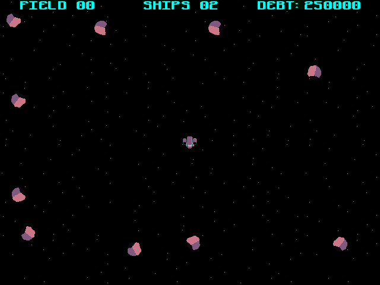

# Deep Scavenger - A space scavenging game for the Commander X16

In this game you are deep space scavenger Rick Frost who has been arrested for smuggling stolen goods. Your motives were kind though as the goods were for a colony of people on a small moon who are in need of food and medical supplies. A large corporation has been exploiting them and blocking their supplies. You stole the goods from this corporations to deliver to the colonists, but were finally caught. The courts (which are basically owned by the corporations) have slapped you with a massive fine. Your choices, do years of hard labor in a camp that most prisoners never return from to pay off the fine, OR, go to work for the corporation making dangerous deep space scavenging runs to collect valuable minerals, crystals, and rare elements.

## Gameplay
Shoot open asteroids and collect the valuable crystals inside to pay down your debt. Avoid mines and enemy ships. Cutscenes every few levels show Rick's interactions with his friends, enemies, and possible love interest?

## Tech

This game is written entirely in 65c02 Assembly for the Commander X16. It's compiled with CC65.

### Debugging notes

DEEP.list file off by 2064 bytes. Add to memory addr.
